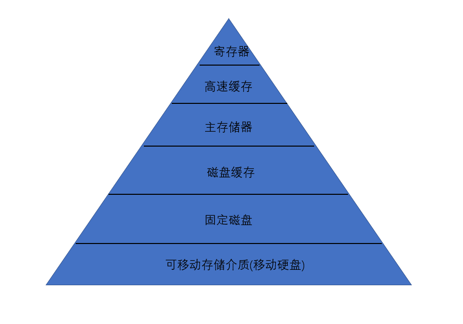
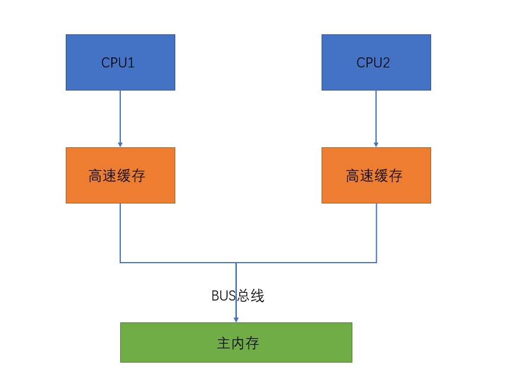
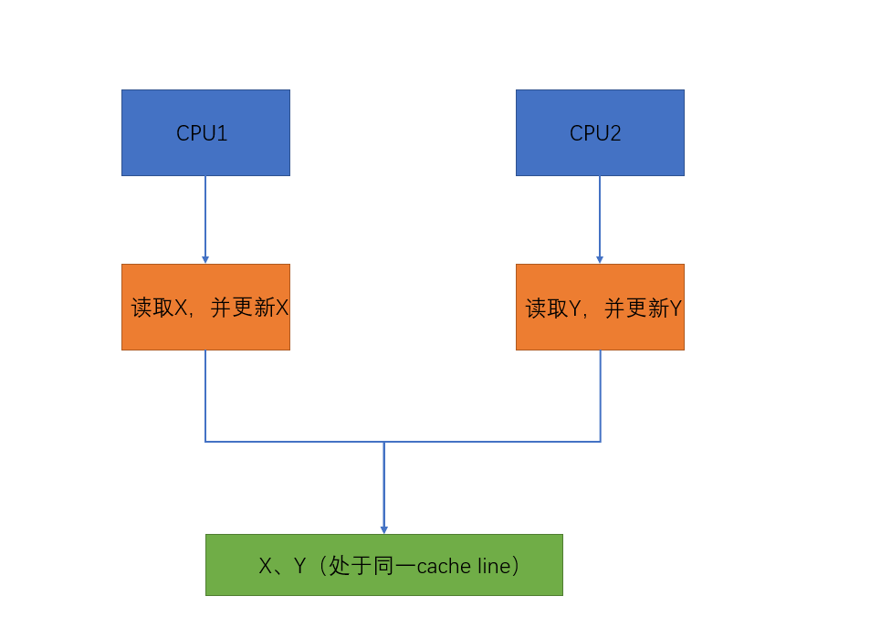
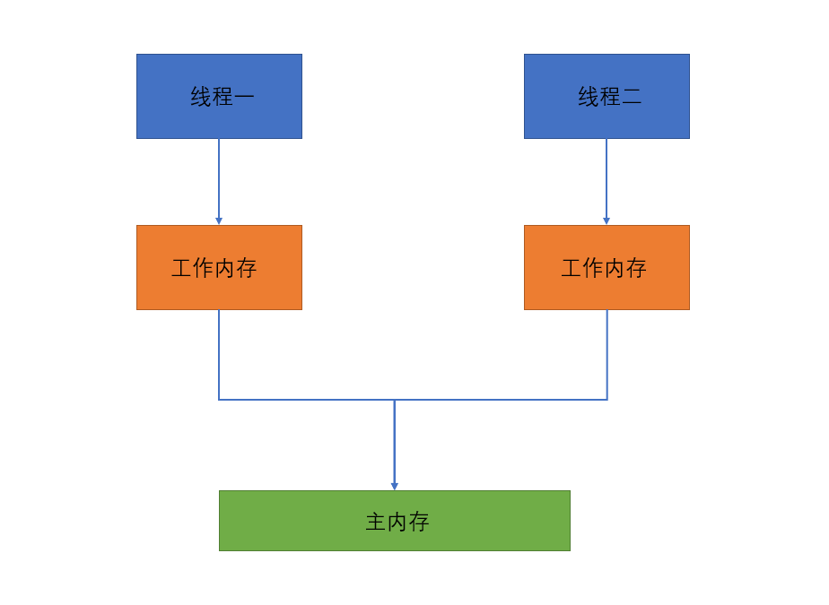

## 引入
```
本文主要涉及的内容如下: 操作系统层面上的并发解决方案、JMM(Java内存模型)、内存屏障、volatile关键字
的底层原理, 这些内容是连贯性的, 只有明白了每一节的内容, 才能够将后面的内容理清楚, 整篇内容以计算机
操作系统的知识以及JVM相关知识作为基础进行分析, 所以如果想完全掌握笔者本篇内容的知识, 需要具备相应的
知识体系(=,=其实大家会发现, 我的并发文章永远是以操作系统作为基础进行分析的),本着原创的角度出发, 我
的文章所有的内容都是基于我个人的理解去写的, 如果涉及到相关的引用我会说明引用的文章的出处, 如果大家
发现了文章的问题, 可以跟我一起讨论=,=
```

## 硬件的层次结构(参考计算机操作系统-汤小丹[考研408标准教材])
### 存储器的存储结构
- 标准的存储结构
```
由下图所示[该图片摘自计算机操作系统第130页], 计算机的存储结构分为寄存器 => 高速缓存 => 主内存 =>
磁盘缓存 => 固定磁盘 => 可移动存储介质, 这里主要介绍寄存器, 高速缓存以及主内存, 因为正是由于这些的
存在, 才导致了并发相关问题出现的
```



- 寄存器、高速缓存、主内存的相关描述
```
随着计算机的不断发展, CPU发展的速度远远的高于内存的发展速度, 在目前的情况, CPU的读写速度是非常快的,
根据笔者的印象, 貌似是内存的几百倍(总之比内存快很多, 不用纠结具体多少倍), 为了缓解这种速度不一致的
矛盾, 从而引入了寄存器, 高速缓存这样的媒介, 从而使得CPU在读取数据的时候, 会先读取寄存器的, 如果没有
则查找高速缓存, 高速缓存没有, 才会访问内存, 在计算机操作系统中描述中, 高速缓存又分为了L1, L2, L3缓
存, 那么为什么要分这么多级呢, 其实就是因为越接近于CPU的媒介, 其读写速度就越快, 容量越小, 但是相应的
价格也就越贵, 所以说这些媒介的读写速度是与其价格成正比的, 而与其存储容量成反比, 为了更加的方便我们
对知识体系的整理, 我们将不再将高速缓存进行拆分, 这并不会影响我们对并发内容的理解
```

- 数据不一致的引入
```
根据上面的内容我们可以了解到, CPU与内存之间相隔了多级缓存, 那么就会出现一个问题, 我们假设这样的场景,
现在有两个CPU, 都想对内存的变量x进行加1的操作, CPU1先从内存中读取变量x的内容, 先存储到高速缓存, 再
从寄存器中读取, 同时CPU2也做了这样的一件事情, 这时后CPU1对x进行了加1的操作, 并写回了内存, CPU2也
做了相同的操作, 也写回了内存, 两次加法操作最终竟然只变成了一次加法操作, 这就是典型的数据不一致的问
题, 原因是CPU1对数据的修改对于CPU2是没法得知的
```

### 硬件层面解决数据不一致的问题
- BUS总线锁机制
```
由下图可知, 在CPU与主内存的数据交互中, 每个CPU对应的高速缓存都会走相同的通道, 从而与主内存进行数据
交互, 这条通道就是大名鼎鼎的数据总线(BUS), 相信对计算机组成原理有系统学习的同学一定不会陌生吧, 在计
算机的CPU与RAM之间进行数据传输时就需要用到这个数据总线, 这里简单的扩展一下, 还有其它几种总线, 比如
地址总线, 控制总线等, 由下图可以看到, 如果想要保证数据的一致性, 把那个总线锁住不就好了, 这样就只能
由一个CPU对内存进行操作了, 当其操作完后才能轮到其它CPU, 相信有所思考的同学已经想到了, 这也太霸道了
吧, 有种[此路是我开, 此树是我栽]的强盗感觉=,=没错, 虽然BUS总线锁能够保证数据的一致性, 但是也会造成
很严重的性能瓶颈问题, 所以在现代的计算机中, 是不可能直接采用这种方式的
```



- 缓存一致性协议(参考书籍[大话处理器])
```
根据上面的讲解可以得知, 之所以会导致这种数据不一致的问题, 就是因为缓存的引入, 所以之后就出现了这种
缓存一致性协议来解决数据一致性问题以及BUS总线锁性能问题, 缓存一致性协议有很多种, 我们这里以应用广泛
的MESI协议来进行讲解, 这个协议主要通过四个状态来保证数据的一致性, 为了更好的让大家理解这个协议, 下
面我先以自己的话来描述, 相信这些话能够让大家知道怎么一回事

MESI协议的四个字符描述:
  M: modify, 更新标志, 表示该缓存数据被当前线程修改过, 但是还没有写入内存
  S: shared, 共享标志, 表示该缓存数据在其它CPU的缓存中也存在, 但是大家都没有修改过
  E: Exclude, 独享标志, 表示该缓存数据被当前线程独享, 其它CPU没有读取该数据到缓存
  I: invalid, 无效标志, 表示该缓存数据是无效的, 即数据没有被缓存或者说已经失效了

下面我以实际的场景来描述一下这四个状态的转变

假设在高速缓存中有一块区域, 初始的时候其状态是I, 这时候线程1将内存的变量X读取到了这块区域, 此时这块
区域的状态变为了E, 即当前线程独享了, 其它CPU没有读取过, 此时线程1将X修改为x+1, 这时候这块区域就变
成了M状态, 但是此时是还没有写入到内存的, 这时候线程2从内存读取变量X到该线程对应的CPU中的缓存区域,
MESI协议此时会将线程1的数据写入内存, 将线程1的缓存区域的状态置为I, 线程2的缓存区域状态设置为E, 之后
线程1又读取了X数据, 此时线程1和线程2的高速缓存状态都会变成S, 即共享状态, 这时候一旦一个线程修改了
X的值, 另一个线程的状态就会变为I, 即无效, 从而要从内存中读取这个数据
```

- cache line的引入
```
在上述对缓存一致性协议MESI进行描述的时候, 我们得知了CPU会将数据从主内存先读取到缓存中, 但是在真实的
场景中不是这样的, CPU为了提高工作的效率, 会一下子从内存中读取一块数据, 而不是仅仅读取相应的数据到缓
存中, 那么到底读取多少数据呢?即一个缓存行的数据(cache line), 那么一个缓存行到底有多少呢?不同的实现
中肯定是存在差异的, 但是大多数都是64个字节, 即8个long型的数据, 所以上面的所有描述, 都应该用缓存行
替换掉, 总结一下, 在高速缓存中, 以缓存行作为单位, CPU一下子会从内存中读取一个缓存行的数据(64个字节),
MESI协议是针对于缓存行的, 一旦一个缓存行中的某个数据发生了改变, 整个缓存行的状态都会变化, 即四个状态
是针对于缓存行的
```

### cache line导致的伪共享问题
- 伪共享问题的引入即优化方案
```
伪共享问题:
  假设数据X与数据y处于同一个缓存行, 线程一访问X, 线程二访问y, 此时这两个线程会一次把x，y所在的缓存
  行读取进高速缓存, 那么一旦线程一对x进行修改, 就会导致线程二的数据y也失效, 反之也是如此, 从而需要
  再从内存中读取数据, 这就是伪共享问题

如果解决伪共享问题:
  只需要将这些数据放入到不同的缓存行就可以了, 那么如何保证在不同的缓存行呢?利用填充的方式, 把一个数
  据填充成64个字节, 这样就可以避免伪共享问题了, 现在已经有一些开源的框架应用到了这种方式来提高性能
  了, JDK中也有类似的实现, 这里就不进行扩展了
```



- 伪共享问题的案例重现一: 将数据置于同一个缓存行, 两个线程修改不同的数据
```java
public class CacheLine1 {
  /**
   * 数组的空间是连续的, 所以基本可以确保arr[0]和arr[1]在同一个缓存行
   * 这里之所以要用volatile是因为能够使得数据及时的刷新到内存, 即为了使得MESI协议生效,
   * 这个是volatile关键字的原理, 之后我们会进行讨论, 在这里是为了使得MESI协议生效
   */
	private static volatile long[] arr = new long[]{ 6666L, 6666L };
	public static void main (String[] args) throws InterruptedException {
		long start = System.currentTimeMillis();

    // 开启两个线程对数据进行修改10亿次
		Thread t1 = new Thread( () -> {
			for ( int i = 0; i <= 100000_0000; i ++ ) {
				arr[0] = i;
			}
		} );

		Thread t2 = new Thread( () -> {
			for ( int i = 0; i <= 100000_0000; i ++ ) {
				arr[1] = i;
			}
		} );

		t1.start();
		t2.start();

		t1.join();
		t2.join();

		long end = System.currentTimeMillis();
		System.out.println( "运行了: " + ( end - start ) + "毫秒" );

	}
}


结果(大家可以多试几次取平均值):
  运行了: 4355毫秒
```

- 伪共享问题的案例重现二: 将数据置于不同的缓存行, 两个线程修改不同的缓存行数据, 性能得到提高
```java
public class CacheLine1 {
  // 两个缓存行
	private static volatile long[] arr1 = new long[]{ 6666L, 6666L, 6666L, 6666L, 6666L, 6666L, 6666L, 6666L };
	private static volatile long[] arr2 = new long[]{ 6666L, 6666L, 6666L, 6666L, 6666L, 6666L, 6666L, 6666L };
	public static void main (String[] args) throws InterruptedException {
		long start = System.currentTimeMillis();

    // 两个线程修改不同的缓存行数据
		Thread t1 = new Thread( () -> {
			for ( int i = 0; i <= 100000_0000; i ++ ) {
				arr1[0] = i;
			}
		} );

		Thread t2 = new Thread( () -> {
			for ( int i = 0; i <= 100000_0000; i ++ ) {
				arr2[0] = i;
			}
		} );

		t1.start();
		t2.start();

		t1.join();
		t2.join();

		long end = System.currentTimeMillis();
		System.out.println( "运行了: " + ( end - start ) + "毫秒" );

	}
}

结果:
  运行了: 1092毫秒
```

- 总结
```
硬件层次处理数据不一致问题有两种方案, 一种是在总线BUS上加锁, 缺点是同一时间只能有一个CPU访问内存,
造成性能低下, 第二种是利用缓存一致性协议, 比较广为人知的一种是MESI协议, 该协议利用四个状态量来达到
数据的一致性, 在缓存一致性协议中, CPU不是每次只读取需要的数据, 为了提高性能会读取一个缓存行的数据,
在当代CPU中, 大部分的缓存行是64个字节, 提到缓存行, 就不得不谈到的是伪共享问题, 伪共享问题的实质是
多个线程读取的不同数据是同一个缓存行的, 从而造成了一个CPU对数据的更改就会立马使得其它CPU的缓存行失
效, 解决方案就是将需要的数据放置在不同的缓存行
```

> 这里需要注意的是, 在目前的CPU实现中, 为了能够实现数据的一致性, 会采用缓存一致性协议和总线锁来一起实现, 而不是只采用其中一个,
纠其原因就是, 在特殊的情况, 缓存一致性协议并不能保证数据的一致性, 比如需要缓存的数据过大, 缓存行存不了的时候, 就必须采用总线锁来实现数据一致性

## 谈谈并发编程中的三大特性
### 引入
```
并发编程中不得不提到的三大特性, 原子性、有序性、有序性, 下面我简单的来描述下三大特性的意思:
原子性:
  一个操作或者多个操作要么都执行成功, 要么都执行失败, 操作执行的过程中不允许中断, 规范中表示, 对于
  基本数据类型的变量的读取和赋值是保证了原子性的, 不可中断的
    比如: int a = 10就保证了原子性, 但是int b = a;就不能保证原子性了, 因为这里涉及到了两个操作,
    取a的值和赋值b, 再比如a++也不能保证原子性, 这里是三步操作, 取a和对a进行加1以及将结果赋值给a

可见性:
  一个线程对一个共享变量的修改必须使得该修改让其它同时共享该变量的线程知道, 即一个线程对一个数据的
  操作必须让其它线程能够立马感知到, 而volatile关键字就能够实现这个效果

有序性:
  有序性是指对于代码的执行必须是顺序执行的, 即编写在前面的代码必须优先于后面的代码的执行, 其中JVM
  对代码的重排序优化就是没有达到这个要求的, 指令重排序指的是对于一些没有依赖的代码, JVM为了提高性能,
  会对这些代码的执行指令进行重新排序执行, 而不是按照我们编写的顺序执行, 并且重排序的最终结果必须是
  与原来一致的
```

### Java内存模型(JMM)
- 什么是Java语言规范和Java内存模型
```
Java内存模型, 是Java规范中的其中一部分, 位于Java Language Specification的第17张, 这里我提供一下
Java语言规范的JDK8的版本[https://docs.oracle.com/javase/specs/jls/se8/html/index.html], 那么
首先我们需要知道Java语言规范是做什么用的呢?其是用来规定一种虚拟机的实现必须遵守的规则, 我们知道Java
语言是要被编译成字节码的, 那么这个字节码到底代表什么意思, 在操作系统层面到底是怎么执行的呢?这个就由
不同的虚拟机来实现了, 当然实现也就不同了, 那么Java内存模型到底是做什么用的呢?其是Java语言规范中的
一种, Java内存模型规定了虚拟机的指令执行的合法性, 当虚拟机在实现自己的指令的时候, 必须遵守Java内存
模型, 使得操作是可预测的, 但是可以有不同的实现, 举个例子, Java内存模型规定了线程的start方法的调用
必须优先于该线程中的所有操作, 但是虚拟机可以有不同的实现, 比如说start方法调用后, 简单的休眠一秒, 这
也是没问题的, 当然仅仅只是举个例子而已

总结一下:
  Java语言规范指的是虚拟机在实现Java语言的字节码指令时需要遵循的规范, Java内存模型是Java语言规范的
  其中一种, 规定了程序的执行是可预测的, 需要依照特定的规则来执行指令, 规定虚拟机是如何对内存进行操作,
  如下图所示, Java内存模型规定, 在Java与主内存之间设置了工作内存, 每次变量的读取和写入都于工作内存
  进行交互, 之后再将工作内存与主内存进行交互, 这里需要注意的是, Java内存模型和上面我们所说的存储器
  结构是没有一点关系的, 对于Java内存模型中的工作内存可以是存储器中的高速缓存, 也可以是主内存, 而
  Java内存模型中的主内存也可以是高速缓存和主内存, 这取决于不同的虚拟机实现, 很多文章将工作内存映射
  成了高速缓存, 将Java内存模型中的主内存映射成了存储器中的主内存, 这其实是相当大的一个错误
```



- happens before原则
```
谈到Java内存模型, 就不得不谈谈happens before原则了, happens before原则规定了一些操作的顺序及其它
的一些约束, 其属于Java内存模型中的一部分, 主要有以下几条:
  1、代码的执行顺序, 编写在前面的发生在编写在后面的
  2、unlock必须发生在lock之后
  3、volatile修饰的变量, 多个线程对其操作时, 写操作必须先于读操作
  4、传递规则, 代码A先于代码B执行, 代码B先于C执行, 则代码A必定先于C执行
  5、线程启动规则, 线程的start方法肯定先于run方法的执行
  6、线程中断规则, interrupt动作必须先于捕获该动作之前(catch语句)
  7、对象销毁规则, 初始化必须先于finalize之前
  8、线程终结规则, 所以的操作必须发生在线程死亡之前

根据JLS中的描述:
  Two actions can be ordered by a happens-before relationship. If one action happens-before
  another, then the first is visible to and ordered before the second.

翻译:
  两个操作能够通过happens-before的关系来进行排序, 如果一个操作happens-before另一个操作, 那么这个
  第一个操作对于第二个操作来说必须是可见的, 以及有序的

总结:
  happens-before原则其实规定了内存的可见性, A happens-before B, 则表示A操作的结果必须对于B操作来
  说是可见的, 同时有传递性
```

- as-if-serial
```
as-if-serial, 指的是在单线程的情况下, 就跟序列化一样, 无论如何重排序, 执行的结果都不会变
```

### 深入剖析原子性
```
在操作系统的层面上, 利用wait, signal原语来实现了同步机制, 进而诞生了管程, JVM层面上, 通过monitorEnter
和monitorExit两个指令以及标识符[synchronized]来实现了同步机制, java语言的层面上, 通过synchronized
关键字来实现了同步机制, 所以其映射关系就如下所示:
  synchronized关键字/synchronized修饰的方法体 => monitorEnter以及monitorExit指令
  => 管程ObjectMonitor => wait/signal原语

这里我就不再进一步分析synchronized是如何实现的原子性了, 在笔者的上篇文章中已经写的不能再详细了!!!
```

### 深入剖析可见性
- 引入
```
在硬件的层面上, 通过缓存一致性协议及总线锁来使得数据是一致的, 数据的可见性, 这在上面已经讲解的很清
楚了, 在JVM层面通过AccessFlags[ACC_VOLATILE]来实现可见性, 达到数据的一致, 在Java语言的层次上, 通过
volatile关键字来实现可见性, 数据的一致性, 总的来说, 这三层关系的映射如下:
  volatile关键字 => ACC_VOLATILE标志符 => 缓存一致性协议(MESI)及总线锁

这里需要注意的是, 根据Java语言规范中的JMM中的happens-before原则, unlock发生在lock之后, 同时根据
happens-before原则, unlock之后的操作必须对lock是可见的, 由此可以得出, 对于synchronized关键字来说
也是实现了内存的可见性的, 其与volatile关键字的内存可见性不同在于, volatile关键字是针对一个变量的
读写的, 而synchronized是针对于一块区域的
```

- 一个简单的案例来看看没有实现可见性的情况
```java
public class TestClass {
	private static int num = 0;

	public static void main (String[] args) {
		new Thread( () -> {
			System.out.println( "开始执行死循环" );
			while ( num == 0 );
			System.out.println( "结束执行死循环" );
		} ).start();

		new Thread( () -> {
			System.out.println( "开始休眠" );
			try {
				Thread.sleep( 3000 );
				num = 1;
			} catch (InterruptedException e) {
				e.printStackTrace();
			}
			System.out.println( "结束休眠" );
		} ).start();
	}
}

结果:
  开始执行死循环
  开始休眠
  结束休眠

线程一直处于死循环状态, 由此可见, num = 1这个操作对于线程一来说是不可见的, 也就是内存的不可见, 但是
当我们对num加上了一个volatile关键字后, 就会发现结果变成了如下:
  开始执行死循环
  开始休眠
  结束休眠
  结束执行死循环
```

- 总结
```
volatile关键字能够保证内存的可见性, 映射到JVM层面就是一个ACC_VOLATILE标志位, 该标志位映射到操作系
统的底层就是缓存一致性协议和总线锁, 缓存一致性协议的基本单位是缓存行(64个字节), 在计算机的底层, 通过
Lock指令来达到总线锁以及缓存锁的效果, 总线锁很好理解, 就是锁住BUS总线, 那缓存锁是什么呢?其实就是用
来保证缓存一致性协议执行的的原子性！！！
```

### 深入剖析有序性
- CPU乱序执行和指令重排序
```
CPU为提高执行的效率, 会在一条指令执行的同时去执行另一条指令, 前提是这两条指令是没有任何关联关系的,
比如说CPU在执行从内存中读取x指令的同时, 假设这个读取操作较慢, 那么CPU可能会同时执行另一条指令如从
内存中读取y指令, 这就是CPU的乱序执行, 但是CPU是能够保证乱序执行是不会改变结果的

指令重排序指的是JVM为了提高性能, 会对字节码指令进行重排, 但是我们直接看字节码是看不出来的, 指令重排
是有风险的, 比如说大名鼎鼎的DCL单例模式, 就存在指令重排的问题, 从而使得单例实例需要用volatile关键
字进行修饰, 因为一个对象的赋值会涉及到new, invokestatic, astore三个指令, 一旦发生指令重排, 其它
线程就会拿着未初始化完的对象去做事情, 从而造成并发问题

这时候肯定就会有人有疑惑, 笔者说了这么多, 那到底指令重排能否验证是否存在呢?这里告诉你一个好消息, 还
真就能验证出来, 接下来就让我们来见证奇迹吧!!!!!!!!!
```

- 验证指令重排序代码
```java
public class TestDisOrder {
    private static int a = 0, b = 0, x = 0, y = 0;
    public static void main(String[] args) throws InterruptedException {
        int i = 0;
        long start = System.currentTimeMillis();
        while ( true ) {
            a = 0; x = 0;
            b = 0; y = 0;
            Thread t1 = new Thread( () -> {
                a = 1;
                x = b;
            } );

            Thread t2 = new Thread( () -> {
                b = 1;
                y = a;
            } );

            t1.start();t2.start();
            t1.join();t2.join();

            System.out.println( String.format( "第%s次执行循环, 结果为[x=%s, y=%s]", ++i, x, y ) );
            if ( x == 0 && y == 0 ) {
                System.out.println( "出现指令重排" );
                break;
            }
        }

        long end = System.currentTimeMillis();

        System.out.println( "出现指令重排所经历的时间: " + ( ( end - start ) / 1000 ) + "秒" );
    }
}
```

- 分析
```
在上述的实验中, 笔者在经历了37秒后, 主线程退出了循环, 由此可见, 指令重排序真的是存在的, 并且通过上
述的实验来看, 指令重排序在单线程下不会有隐患, 一旦到了多线程环境, 就会很容易出现并发问题
```

- 如何保证有序性(内存屏障)
```
通过指令重排序的实验我们可以深刻的了解到JVM在进行性能优化的同时所带来的并发问题, 那么是否有办法使得
指令重排序不生效呢?是否有办法使得CPU不乱序执行呢?这里就需要说到内存屏障了, 故名思意, 内存屏障就是在
对内存的读写操作之前增加一层屏障, 下面我们对硬件层面上的内存屏障指令以及JVM层面上的内存屏障指令语义
进行分析:

硬件层面上的内存屏障:
  sfence: s即为store, 其语义是在sfence指令前的写操作当必须在sfence指令后的写操作前完成
  lfence: l即为load, 在lfence指令前的读操作当必须在lfence指令的读操作前完成
  mfence: m即为merge, 在mfence指令前的读写操作当必须在mfence指令后的读写操作前完成

JVM层面上的内存屏障:
  StoreStoreBarrier:
    指令:
      astore1(字节码指令)
      StoreStoreBarrier
      astore2(字节码指令)

    分析:
      由上述的指令可以得出, astore1和astore2两个指令之间有一个StoreStoreBarrier内存屏障, 该屏障
      的意思是在屏障前面的所有写入操作必须先于该屏障后面的写入操作执行

  LoadLoadBarrier:
    指令:
      load1(字节码指令)
      LoadLoadBarrier
      load2(字节码指令)

    分析:
      由上述指令可以得出, load1和load2两个指令之间有一个LoadLoadBarrier, 该屏障的意思是在该屏障
      前面的读取操作必须优先于该屏障后面的读取操作执行

  StoreLoadBarrier:
    指令:
      astore1
      StoreLoadBarrier
      load1

    分析:
      由上述指令可以得出, astore1指令和load1指令之间有一个StoreLoadBarrier内存屏障, 该屏障的意思
      是在屏障前面的写入操作必须优先于该屏障后面的读取操作执行

  LoadStoreBarrier:
    指令:
      load1
      LoadStoreBarrier
      astore1

    分析:
      由上述指令可以得出, load1和astore1指令之间由一个LoadStoreBarrier内存屏障, 该屏障的意思是
      在该屏障前面的读取操作必须优先于该屏障后面的写入操作执行
```

- volatile关键字是如何保证有序性的
```
StoreStoreBarrier
volatile写操作
StoreLoadBarrier

LoadLoadBarrier
volatile读操作
LoadStoreBarrier
```

- 总结
```
CPU为了提高执行的速度, 会进行指令的乱序执行, JVM为了提高性能, 也会存在指令重排序, 在操作系统的底层,
提供了mfence, sfence, lfence这些内存屏障的指令来允许指令进行顺序执行, JVM层面, 提供了
StoreStroreBarrier、LoadLoadBarrier、LoadStoreBarrier以及StoreLoadBarrier这些内存屏障来允许我
们规定指令的执行顺序, 打破重排序
```

### volatile关键字原理的总结
```
volatile关键字能够保证内存的可见性和防止指令重排序, 通过标志位ACC_VOLATILE来映射到操作系统层面的
总线锁和缓存一致性协议, 操作系统层面通过Lock指令来保证总线锁, 以及缓存一致性协议的操作的原子性(即
缓存锁), volatile关键字通过内存屏障来保证防止指令重排序, 通过JLS规范第17章的JMM描述, happensp-before
原则确保了前一个操作的结果对后一个操作是可见的
```

### 后记
```
Java并发编程当中最为重要的两个关键字synchronized以及volatile, 我们通过两篇文章已经全部的叙述完毕
了, 从操作系统的角度出发, 到JVM层次, 最终上升到代码层次, 我们一步步的分析了其中的关联关系, 相信大
家如果把笔者这两篇文章的内容吃透了, 之后的并发学习及应用都会得心应手, 了解了底层的情况下, 用起来不是
更加的自信吗?这一点笔者是可以肯定的, 之前不熟悉hashMap底层的时候, 用起来确实感觉有点模模糊糊, 但是
当我自己实现了红黑树, 再利用红黑树实现HashMap的时候, 我发现我对hashMap的理解已经非常的深入了, 在
项目中可以对数据结构进行灵活的使用了, 最后, 可以给大家一个提示, 想要学习好并发, 必须学习好计算机操
作系统, 脱离了操作系统的理论去聊并发是没有任何意义的, 更广泛的, 想要学习好编程, 必须学习好计算机专
业的四大基本课程[计算机操作系统、计算机网络、数据结构、计算机组成原理], 这是编程的基石, 这些话都是
以前实习的时候我的导师告诉我的, 在此送给大家=,=

路漫漫其修远兮, 如果大家有研究底层的心, 相信你看到的编程世界会更加的丰富多彩, 而不是仅仅有CRUD=,=
```

