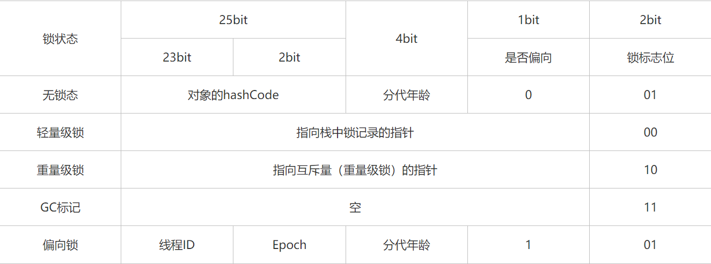

## 引入
```
针对于之前的synchrnonized的底层原理的文章中, 还需要深入讨论下去的就是对象, 在synchrnonized的文章
中, 我们知道了一个普通的对象往往会有一个伴生对象ObjectMonitor, 对于普通的对象来说, 其锁标志都存在
对象头中, 这篇文章就是深入的去讲解一个对象的整体形态, 并且会利用代码例子来证明一些理论的内容
```

## 对象的创建过程
### 类加载的过程
```
一个对象在创建之前, 其对应的类文件必定是要被ClassLoader加载进内存的, 那么一个类什么时候会被加载呢?
在我的JVM的文章中有说到, 当一个类被主动使用的时候, 该类会被加载, 并执行初始化, 主动使用有以下几种常
见的情况:
  <1> 调用类的静态方法
  <2> 对类的静态属性进行读写
  <3> 创建该类的实例(new)
  <4> Class.forName反射
  <5> 初始化一个类的子类(会导致其父类被初始化)

当满足上述情况的时候, 就会被类加载器加载, 从而执行加载 => 连接 => 初始化三个步骤

下面简单的解释下这三个步骤:
  加载: 将class文件加载进内存
  连接: 连接又分为三步
      验证: 验证class文件的正确性, 由于class文件需要被JVM解析才能执行, 那么就需要验证该class文件
            的语法是否正确, 是否符合虚拟机的要求
      准备: 对类的静态成员变量赋默认值, 比如private int i = 10, 在此时i会被默认设置为0, 引用类型
            的默认值为null
      解析: 将类的符号引用转为直接引用, 比如Object obj = new Object(), 对于这样的代码来说, obj
            一开始是指向常量池中的一个字符串符号标记而已, 此时会将这个符号引用转为真正的内存地址
  初始化: 对类的静态成员变量赋初始值, 即我们期望给定的值
```
### 对象创建的过程
```java
当类加载器对一个类进行完上述操作后, 一个类就被真正的加载到了内存, 由于我们讨论的是对象的创建过程,
一个对象假设是被new出来的, 有兴趣的可以查看一下反编译的class文件, 会发现所有的成员变量、实例代码块
的代码以及构造方法都会被整合init方法中, 当执行new语句的时候, 会先调用Object对象的init方法, 然后按
顺序完成成员属性以及非静态代码块的调用, 最后才是构造方法中语句的调用, 下面我们用一个简单的例子来看看
对象的初始化(类的初始化会被放入clinit方法中, 道理也是类似的)

public class TestClass {
	{
		int a = 11;
	}

	int b = 10;

	public TestClass () {
		System.out.println( "Abc" );
	}
}

反编译后的部分字节码:

0: aload_0
1: invokespecial #1                  // Method java/lang/Object."<init>":()V
4: bipush        11
6: istore_1
7: aload_0
8: bipush        10
10: putfield      #2                  // Field b:I
13: getstatic     #3                  // Field java/lang/System.out:Ljava/io/PrintStream;
16: ldc           #4                  // String Abc
18: invokevirtual #5                  // Method java/io/PrintStream.println:(Ljava/lang/String;)V
21: return

1: invokespecial表示调用父类的方法, 即super()
4-6: 等价于int a= 11
8-10: 等价于int b = 10
13-21: 等价于构造方法中的代码

那么肯定会有人有疑问, 怎么不说说0和7是干嘛的呢?
相信大家肯定有在构造方法中使用过this吧, 那么为什么我们没有传入参数也能使用呢?原因就是JVM默认会传入
一个this参数到实例方法或者构造方法中, aload_xxx表示加载第几个引用, aload_0自然就是加载this引用了
```

### 总结
```
一个对象的创建过程需要从类的初始化开始聊起, 当类被初始化完成后才是对象的创建, 总接下来就是以下几个
步骤:
  <1> 加载
  <2> 连接
  <3> 初始化(调用clinit方法)
  <4> 调用init方法
```

## 对象在内存中的布局
### 普通对象
```
一个普通对象主要由三部分组成:
  对象头: 存储了锁的标志, 以及GC的年龄信息, 指向该对象的类对象的指针(Class Pointer)
  实例数据: 所有的实例数据都存在这里, 比如Object obj = new Object(), 那么就会保存该Object的指针
            在该位置, 如果是基本数据类型则保存基本数据类型的值, 引用类型则保存指针(内存地址)
  填充数据: 为了使得一个对象一直是8的倍数(一个字节 = 8位), 当真正的数据不满足该条件时, 会采用填充
            的方式来使其满足
```

### 数组对象
```
一个数组对象会比普通对象多一种数据, 即数组的长度:
  对象头: 存储了锁的标志, 以及GC的年龄信息, 指向该对象的类对象的指针(Class Pointer), 数组长度
  实例数据
  填充数据
```

### 两个有意思的JVM启动参数
```
通过java -XX:+PrintCommandLineFlags -version命令, 在查看Java的版本的时候顺便把启动参数给打印出
来, 在该启动参数中有两个参数如下:

-XX:+UseCompressedClassPointers: 是否使用压缩类指针, 默认开启, 开启的时候, 在对象的布局中, 指向
                                 该对象的类的指针的大小为4个字节, 不开启则为8个字节, 将+号改成
                                 -号则为关闭

-XX:+UseCompressedOops: Oops即[Original Object Pointers]即对象指针, 在实例数据中, 或多或少会
                        存在对象, 那么在实例对象中仅仅保存的是该对象的指针(内存地址), 当开启该
                        参数的时候则为4个字节, 默认为开启, 关闭则为8个字节, 将+号改成-号则为关闭
```

## 对象头具体包含什么
```
在synchronized关键字底层原理分析的文章中, 我们讲到了一个synchronized关键字可能存在偏向锁, 轻量级
锁, 重量级锁三种形态, 其刚好是存在对象头的MarkWord中, 对象头的主要是两部分, 一部分是MarkWord, 一
部分是类型指针, MarkWord占8个字节, 类型指针在开启了指针压缩的情况下为4个字节, 对于一个对象来说, 不
同的锁状态也有不同的布局, 如下图表示MarkWord所示(摘自网上):
  <1> MarkWord一共占据8个字节, 共32位
  <2> MarkWord一共存在5种状态:
        1. 无锁状态
        2. 轻量级锁状态
        3. 重量级锁状态
        4. GC标记
        5. 偏向锁状态
  <3> 不同状态中, 对32位分配的情况也是不一样的
```



## 怎么定位对象在堆空间的位置
```
方式一: 句柄池, 在栈中指向一个堆中的句柄池的引用, 在该句柄池中有两个引用, 一个指向该对象实例的指针,
       一个指向该对象的类对象的指针
方式二: 直接指针, 故名思意, 就是栈中的指针直接指向堆中该对象的位置

比较:
  在GC中, 句柄池的方式更加的高效, 因为GC会导致对象的移动, 但是可以不更新句柄池的位置, 只需要更新句
  柄池中的引用地址即可, 通过直接指针的方式, 需要更新栈中的指针指向
```

## 证明一个对象的大小
### JavaAgent
```
JavaAgent是一种代理机制, 是JVM提供给开发者可以在类被创建之前对类文件进行修改的机制, 在一个main方法
执行之前, JVM提供了该代理机制, 运行执行一个premain方法, 在该premain方法中JVM会往该方法注入两个参数,
String args以及Instrumentation inst, Instrumentation类有一个方法getObjectSize可以获取一个对象
的大小
```

### 构建JavaAgent
- 步骤一: 开启一个新的项目, 在src中创建一个包, 包中存放一个类: MyJavaAgent
```java
package com.fightzhong;

import java.lang.instrument.Instrumentation;

public class MyJavaAgent {
  private static Instrumentation instrumentation;

  // 该类被创建时, JVM会自动地调用premain方法, 并注入两个参数, 我们把第二个参数保存下来
  public static void premain (String agentOps, Instrumentation inst) {
      System.out.println( "premain方法开始执行" );
      MyJavaAgent.instrumentation = inst;
      System.out.println( agentOps );
      System.out.println( "premain方法执行完毕" );
  }

  // 利用Instrumentation对象来获取对象地大小
  public static long sizeOf (Object obj) {
      return instrumentation.getObjectSize( obj );
  }
}
```

- 步骤二: 在src目录下创建一个META-INF文件夹/包, 文件夹中存放一个文件
```
文件名为: MANIFEST.MF
文件内容为: Premain-Class: com.fightzhong.MyJavaAgent
在文件内容后面增加一个回车
```

- 步骤三: 将上述的项目打包成一个jar包
```
进入到对应的项目的class文件所在的根目录(在该目录中可以看到com文件夹以及META-INF文件夹), 执行命令:
jar -cvfm <jar文件的名称> <MANIFEST.MF文件的绝对路径> -C <jar包存放的路径> <参与打包的文件>

如下:
jar -cvfm JavaAgent.jar out/production/JavaAgent/META-INF/MANIFEST.MF -C . .

jar包存放路径为小数点, 表示存放在当前目录, 参与打包的文件为小数点, 表示打包当前文件夹下的所有文件
```

- 步骤四: 将jar包作为lib引入到项目中

- 步骤五: 编写一个简单的对象
```java
基本数据类型所占据的大小:
  byte: 1个字节
  short: 2个字节
  int: 4个字节
  long: 8个字节
  float: 4个字节
  double: 8个字节

对象指针的大小:
  开启了指针压缩即为4个字节, 没开启则为8个字节

public class MyObject {
	private byte b; // 1个字节

	private short s; // 2个字节

	private int i; // 4个字节

	private long l; // 8个字节

	private float f; // 4个字节

	private double d; // 8个字节
}

上述基本数据类型加起来一共27个字节, 对象头中MarkWord占据8个字节, 类型指针(开启了压缩的情况下)4个字
节, 加起来一个37个字节, 由于不是8个倍数, 则填充数据1个字节, 总的40个字节
```

- 步骤六: 查看该对象的大小
```java
public class TestClass {
	public static void main (String[] args) {
		System.out.println( MyJavaAgent.sizeOf( new MyObject() ) );
	}
}

结果: 40
```
