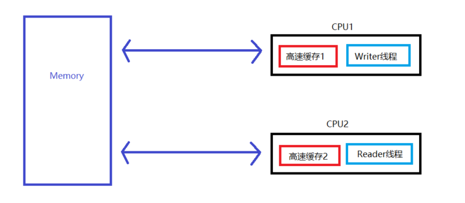

> 文章结构: 一个volatile解决的问题 => CPU缓存不一致性问题 => 谈谈如何使得CPU缓存一致性 => 并发编程中三个概念 => volatile关键字分析

## 一个volatile解决的问题
```java
先来看一段代码: 
public class TestClass2 {
	private static boolean flag = false; // 标志
	public static void main (String[] args) {
    // 线程一
	   new Thread(){
		   @Override
		   public void run () {
			   System.out.println( "线程1执行了" );
			   try {
				   Thread.sleep( 5000 );
			   } catch (InterruptedException e) {}

			   flag = true;
		   }
	   }.start();

     // 线程二
	   new Thread(){
		   @Override
		   public void run () {
		   	while ( !flag ){};
		   	System.out.println( "线程2执行了" );
		   }
	   }.start();

	}
}

分析: 上面的代码中开启了两个线程, 线程一执行了5秒后会将flag置为true, 而线程二在flag为false的时候
      会一直处于循环状态, 直到flag为false的时候才跳出循环, 并输出, 运行上面的代码, 我们发现, 即使
      5秒之后线程二仍然是处于运行状态, 也就是说线程二还处于循环中, 进而证明线程二的flag一直是false,
      即使线程一对flag进行了更改, 线程二读到的值仍然是之前的值, 这就是CPU的缓存不一致造成的, 当我们
      对flag加上一个volatile关键字的时候, 会发现5秒之后线程二执行了输出语句, 程序正常结束了
```

## CPU缓存不一致性问题
```
学过操作系统的都应该了解, 由于CPU的速度最快, 再之后是内存的速度, 在之后是外存的速度, 同时价格刚好
相反, CPU的价格最贵, 内存的价格次之, 相对而言外存的价格就较为便宜, 为了缓解CPU与内存之间以及内存与
外存之间的速度不匹配的问题, 会在CPU与内存之间加入一个高速缓存(速度比CPU慢一些, 比内存快一些, 价格
比CPU便宜些, 比内存贵一些), 在外存与内存之间加入一个磁盘缓存, 从而使得在一定程度上缓解了速度不匹配
的问题, 以CPU与内存来举例说明, 当CPU从内存中读取数据到寄存器的时候, 会在高速缓存中将该数据备份一份
副本, 下一次读取的时候就直接从高速缓存中读取了, 而在CPU对数据进行修改的时候, 会先将数据写入高速缓存,
再由高速缓存去更新内存的数据, 即CPU与内存之间的数据交换需要经过高速缓存

如下图所示(Java内存模型JMM), 假设我们的Reader线程是处于CPU2下执行的, 那么其在读取数据a的时候, 会
先将数据a读入高速缓存2中, 之后每一次读取都是直接从高速缓存2中读取(因为对于Reader线程来说, 没有写操
作), 所以对于上面没有加volatile关键字的案例来说, Reader线程每一次读取的数据都是高速缓存中的, 而对
于Writer线程来说, 由于其存在写操作, 那么其每一次对a的更改都会写回内存中, 并且其高速缓存中的数据也
进行了更改, 所以由于Reader线程所处于的CPU2和Writer线程所处于的CPU1因为缓存的不一致性而导致了上述
问题的发生, 而volatile关键字就是解决了这个问题, 之后我们再详细讨论该关键字, 通过上述的例子是为了引
出缓存不一致的问题
```


## 谈谈如何使得CPU缓存一致性
```
为了解决CPU缓存不一致, 一般有两种方式, 操作系统中有提到, CPU与设备(如内存)进行交互主要是通过总线来
进行的, 总线分为数据总线, 地址总线, 控制总线三种(这里就不进行展开了)

方式一: 给数据总线进行加锁
方式二: CPU高速缓存一致性协议

核心思想: 
  1、当CPU写入数据到内存的时候, 如果发现该数据被共享了(也就是说其它CPU中也存在这个变量的副本), 那么
     其就会发出一个信号, 通知其它CPU该缓存值失效
  2、当其它CPU访问该变量的时候, 重新到内存中获取变量的值   
```

## 并发编程中三个概念
```
原子性(Atomic): 一个操作或者多个操作要么都执行成功, 要么都执行失败, 操作执行的过程中不允许中断, 规
                范中表示, 对于基本数据类型的变量的读取和赋值是保证了原子性的, 不可中断的
                比如: int a = 10就保证了原子性, 但是int b = a;就不能保证原子性了, 因为这里涉及
                      到了两个操作, 取a的值和赋值b, 再比如a++也不能保证原子性, 这里是三步操作, 
                      取a和对a进行加1以及将结果赋值给a

可见性(Visiable): 一个线程对一个共享变量的修改必须使得该修改让其它同时共享该变量的线程知道, 即上面
                  例子中提到的缓存一致性, 当Writer线程对变量a进行修改后, 必须使得Reader线程知道
                  该修改(比如更改后发送一个信号到其它线程告知该变量的缓存失效), 而volatile关键字
                  就是达到了这个效果

有序性(顺序性Order): 有序性是指对于代码的执行必须是顺序执行的, 即编写在前面的代码必须优先于后面的代
                    码的执行, 其中JVM对代码的重排序优化就是没有达到这个要求的, 指令重排序指的是对
                    于一些没有依赖的代码, JVM为了提高性能, 会对这些代码的执行指令进行重新排序执行,
                    而不是按照我们编写的顺序执行, 并且重排序的最终结果必须是与原来一致的

其中有序性遵守一个happens-before原则:
  1、代码的执行顺序, 编写在前面的发生在编写在后面的
  2、unlock必须发生在lock之后
  3、volatile修饰的变量, 多个线程对其操作时, 写操作必须先于读操作
  4、传递规则, 代码A先于代码B执行, 代码B先于C执行, 则代码A必定先于C执行
  5、线程启动规则, 线程的start方法肯定先于run方法的执行
  6、线程中断规则, interrupt动作必须先于捕获该动作之前(catch语句)
  7、对象销毁规则, 初始化必须先于finalize之前
  8、线程终结规则, 所以的操作必须发生在线程死亡之前
```

## volatile关键字分析
```
volatile语义:
  <1> 保证了内存的可见性(可以这样去理解, 当线程A对一个共享数据进行赋值的时候, volatile关键字起到
      的作用就是将这个新的值立马从缓存中写入到内存, 并且对其它同样有该数据缓存的CPU发送信号, 使得
      其它缓存中的数据失效, 这样其它线程就需要重新从内存中取得该数据了)
  <2> 保证了不会进行指令重排序, 举个例子, 创建一个新的对象的时候有三步, 一是在内存中为该对象开辟一
      个内存空间, 二是执行对象的构造方法进行初始化, 三是将该对象的引用返回给变量接收, volatile关键
      字的使用不会导致该对象的创建出现第二步和第三步执行步骤交换的情况
  <3> 不保证数据的原子性          

直观解释:
  <1> 保证重排序不会把后面的指令放在前面执行, 前面的也不会放在后面执行
  <2> 强制对缓存的修改操作立即写入内存
  <3> 对数据的写操作会导致其它CPU中的缓存失效

使用场景: 状态量标记, 如定义的一个标记boolean flag = false; 之后可能会对该标记在其它线程中设置为
          true, 举个例子, 假设A线程和B线程共享这个flag标记, 那么要求A线程执行完毕后将flag置为true
          B线程才能执行, 即B线程必须在A线程执行完毕后执行(此时B线程要轮询判断flag的值), 通过flag
          来判断A线程是否执行完毕, 那么当A线程执行完毕后就需要设置flag为true, 为了防止CPU缓存的不
          一致性导致B线程一直是从缓存中取flag的值, 则将flag用volatile修饰则可以避免这个情况
```
